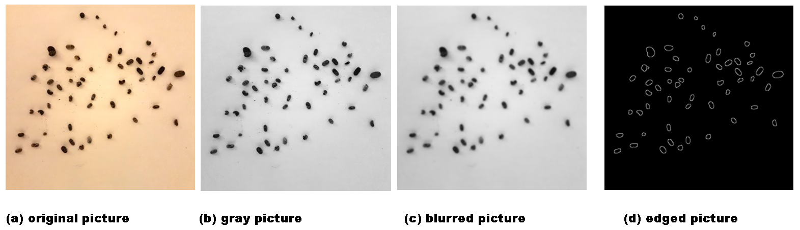
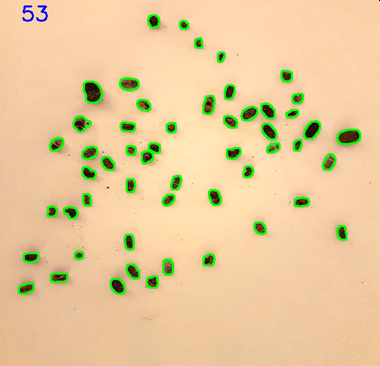
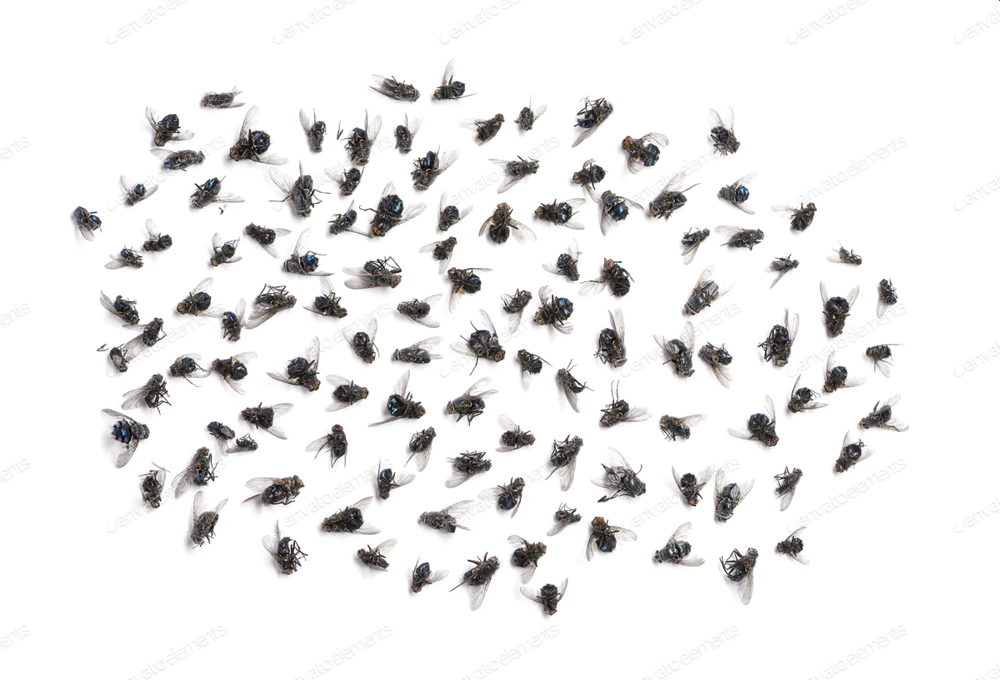
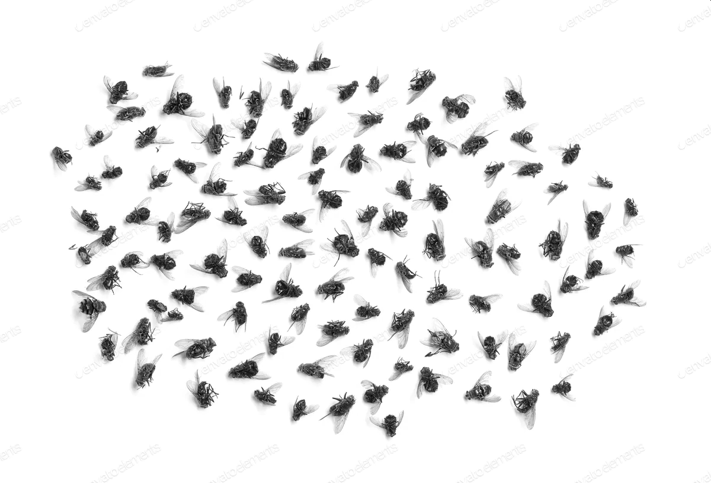
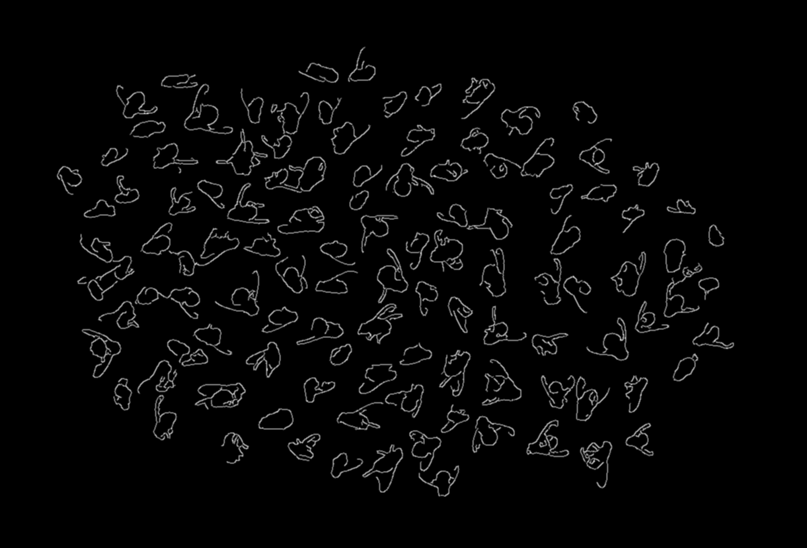
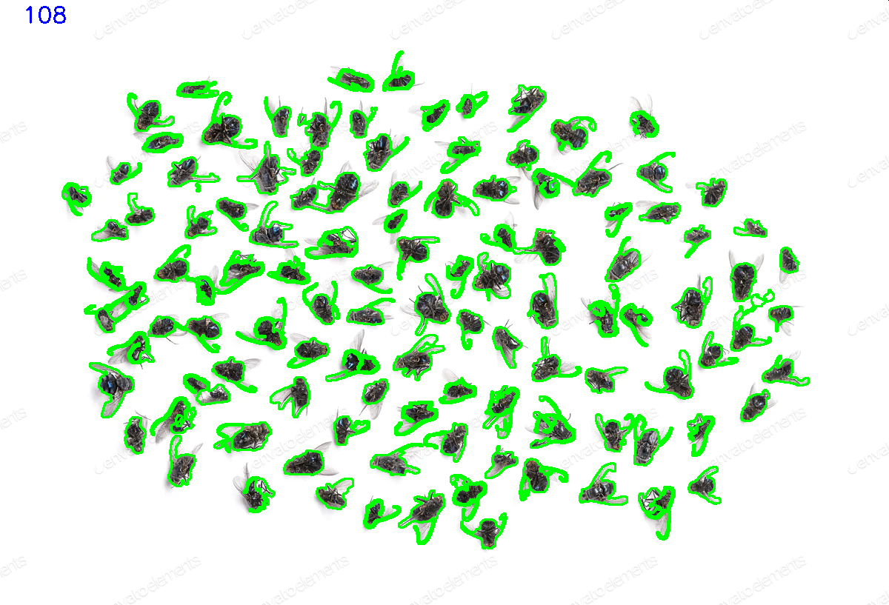

# Counting the number of dead bugs for entomologists

hello

<pre>
This site introduces a new tool for entomologists.

Counting the number of dead bugs or insect corpses on a plane is a very 
time-consuming task. 

The proposed approach is based on BLOB. The term "BLOB" stands for 
"Binary Large OBject".

The proposed algorithm is based on the state-of-the-art Canny edge detection
and Gaussian Blur function using OpenCV library in Python.

Canny edge detection is used for creating blobs and Gaussian Blur function 
for eliminating noises.

Without machine learning, the Python program (pillbug_count.py) can count 
the number of objects in a picture with a uniform colored background.
The conventional machine learning needs to collect and annotate a variety 
of images which is a time-consuming task.

Since I am one of pioneers of neural computing, I know better than anyone 
that collecting images and annotating them is tedious and a waste of time.
</pre>
First book for neural optimization in 1992: <a href="https://link.springer.com/book/10.1007/978-1-4615-3642-0">Neural Network Parallel Computing</a>

First paper published in Science in 1989: <a href="http://science.sciencemag.org/content/245/4923/1221">A near-optimum parallel planarization algorithm, Science, pp.1221-1223 in 1989</a>

Deep vs shallow: <a href="https://ieeexplore.ieee.org/abstract/document/144401/">Functional Link Net Computing: Theory, system Architecture and Functionalities in 1992</a>
   
# How to run pillbug_count.py
<pre>
The target objects in a picture for counting must be separated or isolated. 
Overlapped objects can be counted as one object.

This repository shows how to use a Python program (pillbug_count.py) 
for novice users to automatically count the number of dead bugs or 
the number of insect corpses on a plane for entomologists.

In order to run pillbug_count.py, you should see the following repository 
for installing the necessary libraries:
<a href="https://github.com/ytakefuji/python-novice"> How to install and use libraries in Python for novice users</a>

1. To install an executable Python environment on your operating system 
   (Windows, Mac, Linux), 
   download a Miniconda3 .sh file or .exe file for Python3.8 or Python3.7 
   from the following site:

<a href="https://docs.conda.io/en/latest/miniconda.html">https://docs.conda.io/en/latest/miniconda.html</a>

2. Double-click Miniconda3 .exe file or run the following bash command on
   your terminal:
   $ bash Miniconda3XXX.sh
3. You need to install opencv libray, 
   type the following pip command for installation:
   $ pip install opencv-python
4. To run pillbug_count.py, type the following command for testing:
   $ python pillbug_count.py pillbug.png
</pre>

Result: 53 objects (blobs) are found in pillbug.png file.
<pre>
Use flies.png for further testing.
$ python pillbug_count.py flies.png
</pre>

You should resize an original picture for counting the number of dead bugs. 
Or you should tune the Canny coefficient.

# How to tune parameters for counting in general
pillbug_count.py is shown as follows:
<pre>
import cv2,sys
if len(sys.argv)<2: 
 print("enter figure name")
 sys.exit()

img = cv2.imread(sys.argv[1])
gray = cv2.cvtColor(img, cv2.COLOR_BGR2GRAY)
blurred = cv2.GaussianBlur(gray, (5,5), 0)
blurred = cv2.GaussianBlur(blurred, (7,7), 0)

cv2.imshow("grey scale", gray)
cv2.imwrite("gray.png", gray)
cv2.imshow("blurred", blurred)
cv2.imwrite("blur.png", blurred)
coeff=int((blurred.max()-blurred.min())/100)
if coeff==1: coeff=1 
else: coeff=3
outline = cv2.Canny(blurred, 0, 75*coeff)
outline= cv2.GaussianBlur(outline, (3,3), 0)
cv2.imshow("The edges", outline)
cv2.imwrite("edges.png", outline)
(_, cnts, _) = cv2.findContours(outline, cv2.RETR_EXTERNAL, cv2.CHAIN_APPROX_SIMPLE)
#version4
#( cnts, _)=cv2.findContours(outline,cv2.RETR_EXTERNAL,cv2.CHAIN_APPROX_SIMPLE)
cv2.drawContours(img, cnts, -1, (0, 255, 0), 2)
cv2.putText(img,str(len(cnts)),(30,30),cv2.FONT_HERSHEY_SIMPLEX,1,(255,0,0),2)
cv2.imshow("Result", img)
cv2.imwrite("r.png",img)
print("%i blobs" % len(cnts))
cv2.waitKey(0)
</pre>

# How to resize a picture using resize.py
<pre>
The most important tuning point lies in the size of a picture containing 
the target objects.
The following Python program can be used for resizing the picture of p.jpg
(picture size: 4032x3024). This program is tuned for a smartphone.
resize.py can convert p.jpg (size: 4032x3024) to p.png (size: 550 x 540).
The photo p.jpg was taken with my smartphone. 
resize.py is to generate the resized p.png file from p.jpg.

$ python resize.py p.jpg
</pre>
resize.py can be changed by modifying integer 756 
in img = img.resize((756,int(756*h/w)), Image.ANTIALIAS).

resize.py can rotate, resize, change brightness, image-enhance an image, 
and save the result in p.png file.
<pre>
from PIL import Image,ImageEnhance as ie
import sys

img = Image.open(sys.argv[1])
w,h=img.size
img=img.rotate(270,expand=False)
img = img.resize((756,int(756*h/w)), Image.ANTIALIAS)
img=ie.Brightness(img)
eimg=img.enhance(1.9)
eimg=eimg.crop((100,10,650,550))
eimg.save("p.png") 

</pre>
# How to tune Canny coefficient in pillbug_count.py
<pre>
You should tune and change Canny coefficient instead of "75". 
outline = cv2.Canny(blurred, 0, 75*coeff)
</pre>
# Enjoy pillbug_count.py!!!
